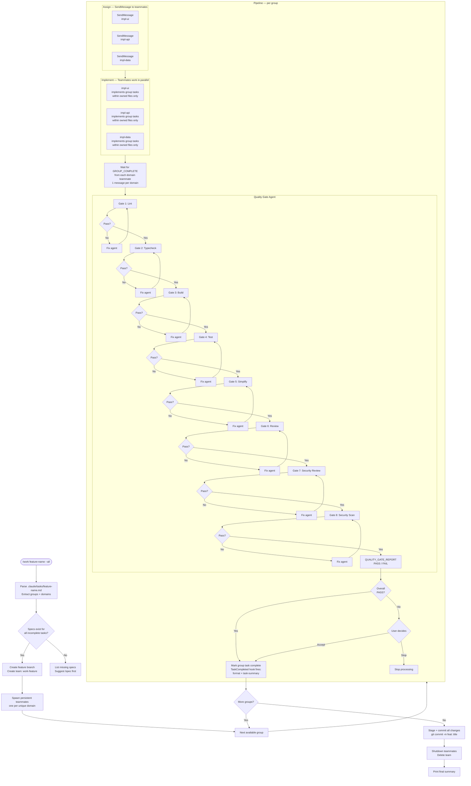

# Agent Teams Work Workflow

This diagram shows the `/work` command flow using agent teams orchestration, where persistent domain teammates collaborate on group-based task execution with shared file ownership boundaries.

