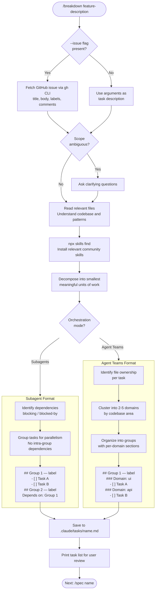

# Breakdown Workflow

This diagram shows the `/breakdown` command flow, covering both subagent and agent teams orchestration modes for decomposing a feature into tasks.

```mermaid
flowchart TD
    Start(["/breakdown feature-description"]) --> ModeDetect{"--issue flag<br/>present?"}
    
    ModeDetect -- Yes --> FetchIssue["Fetch GitHub issue via gh CLI<br/>title, body, labels, comments"]
    ModeDetect -- No --> Freeform["Use arguments as<br/>task description"]
    
    FetchIssue --> Clarify
    Freeform --> Clarify
    
    Clarify{"Scope<br/>ambiguous?"}
    Clarify -- Yes --> AskUser["Ask clarifying questions"]
    Clarify -- No --> Research
    AskUser --> Research
    
    Research["Read relevant files<br/>Understand codebase and patterns"]
    Research --> FindSkills["npx skills find<br/>Install relevant community skills"]
    FindSkills --> Decompose["Decompose into smallest<br/>meaningful units of work"]
    
    Decompose --> FormatCheck{"Orchestration<br/>mode?"}
    
    subgraph SubagentFormat ["Subagent Format"]
        direction TB
        DepAnalysis["Identify dependencies<br/>blocking / blocked-by"]
        DepAnalysis --> GroupParallel["Group tasks for parallelism<br/>No intra-group dependencies"]
        GroupParallel --> SubOutput["## Group 1 — label<br/>- [ ] Task A<br/>- [ ] Task B<br/>## Group 2 — label<br/>Depends on: Group 1"]
    end
    
    subgraph TeamsFormat ["Agent Teams Format"]
        direction TB
        FileOwnership["Identify file ownership<br/>per task"]
        FileOwnership --> ClusterDomains["Cluster into 2-5 domains<br/>by codebase area"]
        ClusterDomains --> GroupDomains["Organize into groups<br/>with per-domain sections"]
        GroupDomains --> TeamOutput["## Group 1 — label<br/>### Domain: ui<br/>- [ ] Task A<br/>### Domain: api<br/>- [ ] Task B"]
    end
    
    FormatCheck -- "Subagents" --> SubagentFormat
    FormatCheck -- "Agent Teams" --> TeamsFormat
    
    SubOutput --> Save["Save to .claude/tasks/name.md"]
    TeamOutput --> Save
    Save --> Print["Print task list for user review"]
    Print --> Done(["Next: /spec name"])
```
