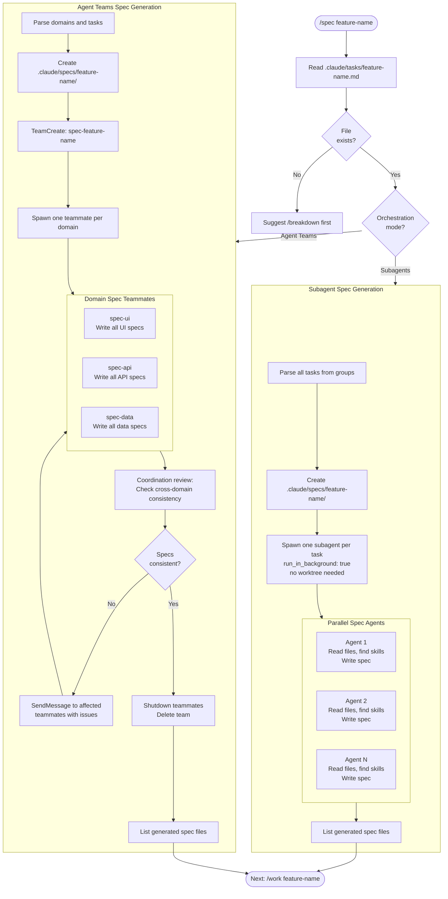

# Spec Generation Workflow

This diagram shows the `/spec` command flow, illustrating how specs are generated in parallel for each task using either subagents or agent teams.

```mermaid
flowchart TD
    Start(["/spec feature-name"]) --> ReadTasks["Read .claude/tasks/feature-name.md"]
    ReadTasks --> Exists{"File<br/>exists?"}
    Exists -- No --> StopMissing["Suggest /breakdown first"]
    Exists -- Yes --> FormatCheck{"Orchestration<br/>mode?"}
    
    FormatCheck -- "Subagents" --> SubagentSpec
    FormatCheck -- "Agent Teams" --> TeamsSpec
    
    subgraph SubagentSpec ["Subagent Spec Generation"]
        direction TB
        ParseSub["Parse all tasks from groups"]
        ParseSub --> CreateDir["Create .claude/specs/feature-name/"]
        CreateDir --> SpawnAll["Spawn one subagent per task<br/>run_in_background: true<br/>no worktree needed"]
        
        subgraph ParallelAgents ["Parallel Spec Agents"]
            direction LR
            SA1["Agent 1<br/>Read files, find skills<br/>Write spec"]
            SA2["Agent 2<br/>Read files, find skills<br/>Write spec"]
            SAN["Agent N<br/>Read files, find skills<br/>Write spec"]
        end
        
        SpawnAll --> ParallelAgents
        ParallelAgents --> ListSpecs["List generated spec files"]
    end
    
    subgraph TeamsSpec ["Agent Teams Spec Generation"]
        direction TB
        ParseTeams["Parse domains and tasks"]
        ParseTeams --> CreateDirT["Create .claude/specs/feature-name/"]
        CreateDirT --> CreateTeam["TeamCreate: spec-feature-name"]
        CreateTeam --> SpawnTeammates["Spawn one teammate per domain"]
        
        subgraph DomainAgents ["Domain Spec Teammates"]
            direction LR
            DT1["spec-ui<br/>Write all UI specs"]
            DT2["spec-api<br/>Write all API specs"]
            DTN["spec-data<br/>Write all data specs"]
        end
        
        SpawnTeammates --> DomainAgents
        DomainAgents --> CoordReview["Coordination review:<br/>Check cross-domain consistency"]
        CoordReview --> Consistent{"Specs<br/>consistent?"}
        Consistent -- No --> SendRevisions["SendMessage to affected<br/>teammates with issues"]
        SendRevisions --> DomainAgents
        Consistent -- Yes --> ShutdownTeam["Shutdown teammates<br/>Delete team"]
        ShutdownTeam --> ListSpecsT["List generated spec files"]
    end
    
    ListSpecs --> Done(["Next: /work feature-name"])
    ListSpecsT --> Done
```
