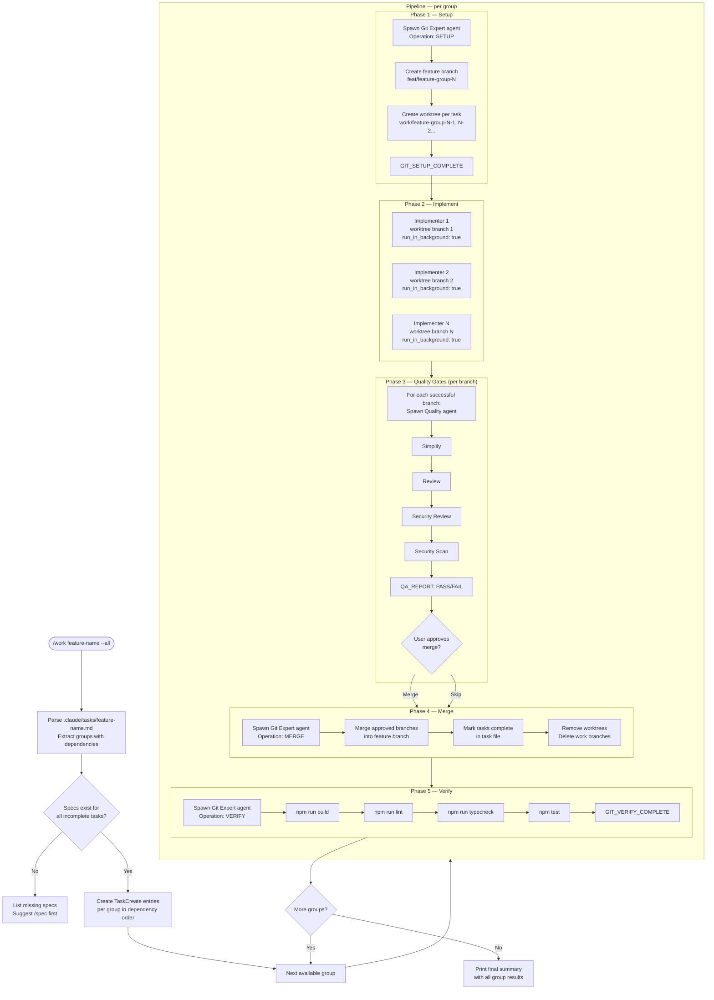

# Subagent Work Workflow

This diagram shows the `/work` command flow using the subagent orchestration mode, where each task runs in an isolated git worktree with parallel implementation and sequential quality gates.

